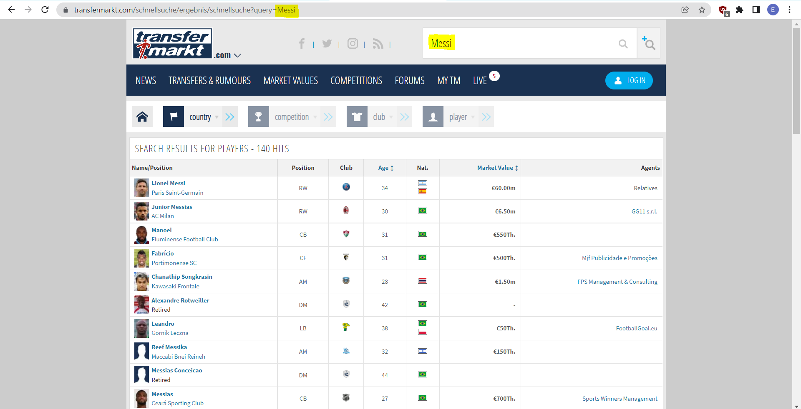

# Transfermarkt Selenium WebScraping 
In this project we will be using selenium with pandas to scrap **Transfermarkt** 
We needed to scrap **Transfermarkt** to get :
* Clubs Logos for each club we have at '**clubs.csv**'    ->  Club_Scrap.py
* Clubs country flag icon for each club at '**clubs.csv**' ->  Club_Scrap.py
* Competition logo for each on at '**competitions.csv**' ->  Comp_Scrap.py
* Competition country icon for each on at '**competitions.csv**'  ->  Comp_Scrap.py
* Player image and country icon for each player '**Player Name.xlsx**'   ->  Imgsearch.py

## Steps needed for each Script :
1. Read csv/Excel sheet using Pandas 
```python 
df = pd.read_excel('{File Name}.xlsx')
# Or
df = pd.read_csv('{File Name}.csv')
```
2. Launch Chromedriver using Selenium
```python
# Get Chrome Driver From 'https://chromedriver.chromium.org/downloads'
Path = "{Chrome Driver Location}.exe"
# Start Chrome driver
driver = webdriver.Chrome(Path)
```

3. Search for the Player/Club/Competition on  **Transfermarkt** 
    * Using 
  ```python 
path = f'https://www.transfermarkt.com/schnellsuche/ergebnis/schnellsuche?query={CName}'
driver.get(path)
  ```
  * By going to this url we go to the website search results for the **{Searched_Value}** 

4. Search for the required  tag using XPATH and get the src attribute
```python
# Find Element by XPATH
img = WebDriverWait(driver, 8).until(EC.presence_of_element_located((By.XPATH, \
      '//*[@id="yw0"]/table/tbody/tr[1]/td[1]/table/tbody/tr[1]/td[1]/a/img')) )
# Get the src attribute from the tag
P_Img =  img.get_attribute("src").replace('small','big')

```
5. Write the answer to the Output.csv 
```python
file_.write("{},{},{}".format(PName.replace('+',' '), P_Img , C_Img))
file_.write("\n")  # Next line.  
```


